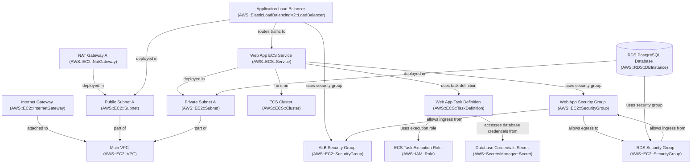

# Proposed Cloud Architecture: Development Containerized Web Application with PostgreSQL

## 1. Requirement Understanding

Deploy a small containerized web application for development purposes.

**Application Type:** Web Application (containerized)  
**Environment:** development

### Functional Requirements

- Containerized web application deployment
- PostgreSQL database backend

### Non-Functional Requirements

- Low cost
- Suitable for development environment
- Secure database access

## 2. Recommended Architecture

The architecture deploys a containerized web application using AWS ECS Fargate, fronted by an Application Load Balancer (ALB). A PostgreSQL database is provided by Amazon RDS, ensuring a managed and secure data store. All resources are deployed within a Virtual Private Cloud (VPC) with private subnets for application and database, enhancing security. Secrets Manager is used for secure database credential management. This setup prioritizes low cost and operational simplicity for a development environment.

## 3. High-Level Architecture Diagram

## 4. Architecture Components

| Resource | Category | Purpose |
| :--- | :--- | :--- |
| Main VPC | ResourceCategory.NETWORK | Provides an isolated network environment for all resources. |
| Public Subnet A | ResourceCategory.NETWORK | Hosts public-facing resources like the ALB and NAT Gateway. |
| Private Subnet A | ResourceCategory.NETWORK | Hosts private resources like ECS Fargate tasks and RDS database instances. |
| Internet Gateway | ResourceCategory.NETWORK | Allows communication between the VPC and the internet. |
| NAT Gateway A | ResourceCategory.NETWORK | Enables instances in private subnets to connect to the internet while preventing unsolicited inbound connections. |
| Application Load Balancer | ResourceCategory.LOAD_BALANCING | Distributes incoming application traffic across multiple targets, such as ECS tasks. |
| ALB Security Group | ResourceCategory.SECURITY | Allows inbound HTTP/HTTPS traffic to the ALB. |
| ECS Cluster | ResourceCategory.CONTAINER | Logical grouping for ECS services and tasks. |
| ECS Task Execution Role | ResourceCategory.IDENTITY | Grants ECS agent permissions to make AWS API calls on your behalf (for example, pulling images from ECR and sending logs to CloudWatch). |
| Web App Task Definition | ResourceCategory.CONTAINER | Defines the container and resource settings for the web application. |
| Web App ECS Service | ResourceCategory.CONTAINER | Maintains the desired count of running tasks and registers them with the ALB. |
| Web App Security Group | ResourceCategory.SECURITY | Controls traffic to the ECS Fargate tasks, allowing inbound from ALB and outbound to RDS. |
| RDS PostgreSQL Database | ResourceCategory.DATABASE | Managed PostgreSQL database for the web application. |
| RDS Security Group | ResourceCategory.SECURITY | Controls traffic to the RDS instance, allowing inbound PostgreSQL traffic only from the web application. |
| Database Credentials Secret | ResourceCategory.SECURITY | Securely stores and manages database credentials for the PostgreSQL instance. |

## 5. Architecture Decisions

### Compute Choice: ECS Fargate vs. EC2

**Decision:** AWS ECS Fargate is chosen for deploying the containerized web application.  
**Rationale:** Fargate is a serverless compute engine for containers, eliminating the need to provision, configure, and scale EC2 instances. This significantly reduces operational overhead and aligns with the low-cost and development-environment requirements by offering a pay-per-use model and avoiding idle EC2 costs.

**Alternatives Considered:**

- **AWS EC2 with Docker/ECS EC2 Launch Type:** Fargate offers a simpler, more cost-effective, and lower-maintenance solution for a development environment with low traffic.

### Database Choice: RDS PostgreSQL vs. Self-Managed PostgreSQL on EC2

**Decision:** Amazon RDS for PostgreSQL is chosen for the database.  
**Rationale:** RDS is a fully managed database service, handling tasks like patching, backups, and scaling. This greatly reduces the operational burden compared to self-managing a database on an EC2 instance, which is important for a development environment where simplicity and maintainability are key. The `db.t3.micro` instance type provides a cost-effective option for development.

**Alternatives Considered:**

- **Self-managed PostgreSQL on EC2:** The operational overhead and expertise required are not suitable for a low-cost, low-maintenance development environment.

### Credential Management: Secrets Manager vs. Environment Variables

**Decision:** AWS Secrets Manager is used for storing and retrieving database credentials.  
**Rationale:** Secrets Manager provides a secure, centralized, and auditable way to manage sensitive information like database credentials. This avoids hardcoding secrets in code or configuration files and simplifies credential rotation.

**Alternatives Considered:**

- **Environment variables directly in task definitions:** Using environment variables for database credentials is less secure and harder to manage safely at scale.

## 6. Security Considerations

- All application and database resources are placed in private subnets, preventing direct internet access.
- Security groups follow least privilege, allowing only necessary traffic between components.
- AWS Secrets Manager is used for secure storage and retrieval of database credentials.
- IAM roles for ECS tasks follow least privilege, granting only necessary permissions.
- The RDS instance is configured with `publicly_accessible: false`.

## 7. Cost Considerations

- ECS Fargate uses a pay-per-use model, which is cost-effective for development with intermittent or low usage.
- RDS `db.t3.micro` is a cost-optimized choice for development databases.
- Deploying resources in a single Availability Zone reduces duplication and transfer costs.
- NAT Gateway adds hourly and data processing cost; for very low usage, a single NAT Gateway is acceptable.
- CloudWatch Logs is generally cost-effective for application logging.

## 8. Assumptions

- The web application container image is available in a container registry such as ECR or Docker Hub.
- The application is stateless or handles state appropriately for containerization.
- The development environment does not require high availability or multi-AZ resilience.
- The application listens on port 80 inside the container.

## 9. Risks and Mitigations

| Risk | Severity | Mitigation |
| :--- | :--- | :--- |
| Single AZ Deployment | RiskSeverity.MEDIUM | This is acceptable for a development environment where cost and simplicity are prioritized over high availability. For production, a multi-AZ deployment for RDS and ECS with multiple private subnets across AZs would be required. |

## 10. Status

**Status:** ArchitectureStatus.READY_FOR_REVIEW  
**Architecture ID:** `dev-container-web-app-postgresql` (`v1.0`)
